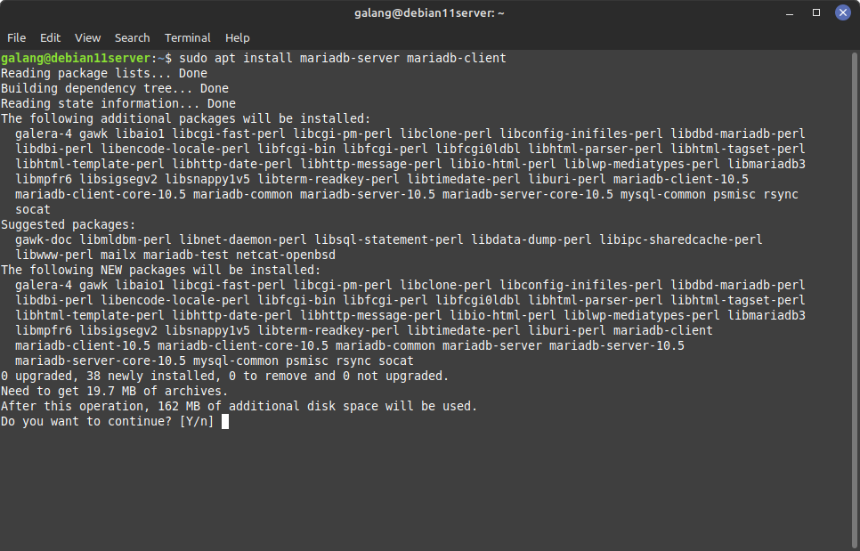
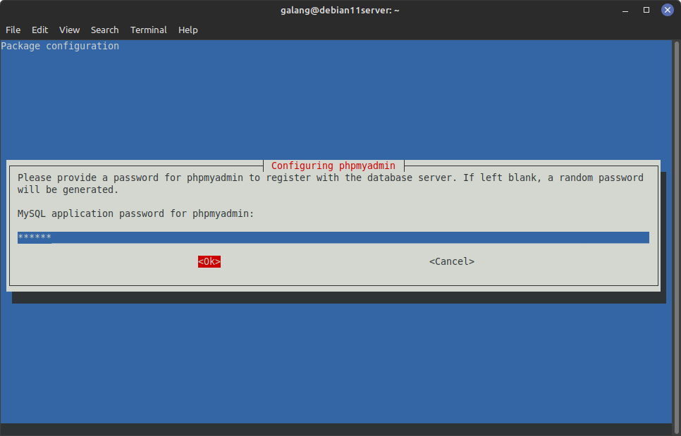

# Tested in Debian 11 Server

## Firewall

```
sudo apt ufw install
```


```
sudo ufw enable
```

```
sudo ufw allow 22
```

## Nginx

```
sudo apt install nginx
```


```
sudo ufw allow 'Nginx Full'
```

```
sudo ufw allow 'Nginx HTTP'
```

```
sudo ufw allow 'Nginx HTTPS'
```


## MariaDB

```
sudo apt install mariadb-server mariadb-client
```



```
sudo mysql_secure_installation
```


```
sudo mysql
```

```
CREATE USER 'user'@'%' IDENTIFIED BY 'password';
```

```
GRANT ALL PRIVILEGES ON *.* TO 'user'@'%';
```

```
FLUSH PRIVILEGES;
```

```
EXIT
```


### Enable MariaDB Remote Access

```
sudo ufw allow 3306
```


```
sudo vim /etc/mysql/mariadb.conf.d/50-server.cnf
```

- Change this
  
- To this
  

- Restart MariaDB

```
sudo systemctl restart mariadb.service
```

## PHP

```
sudo apt install php php-mysql php-fpm
```


```
sudo vim /etc/nginx/sites-available/default
```

- Change this
  
- To this
  
- Change this
  
- To this
  

```
sudo systemctl restart nginx.service
```

## phpMyAdmin

```
sudo apt install phpmyadmin
```





```
sudo ln -s /usr/share/phpmyadmin/ /var/www/html/
```


# CodeIgniter 3 Problem

```
sudo vim /etc/nginx/sites-available/default
```

- Insert this

```
location /your-project {
    try_files $uri $uri/ /your-project/index.php;
}
```


```
sudo systemctl restart nginx.service
```
